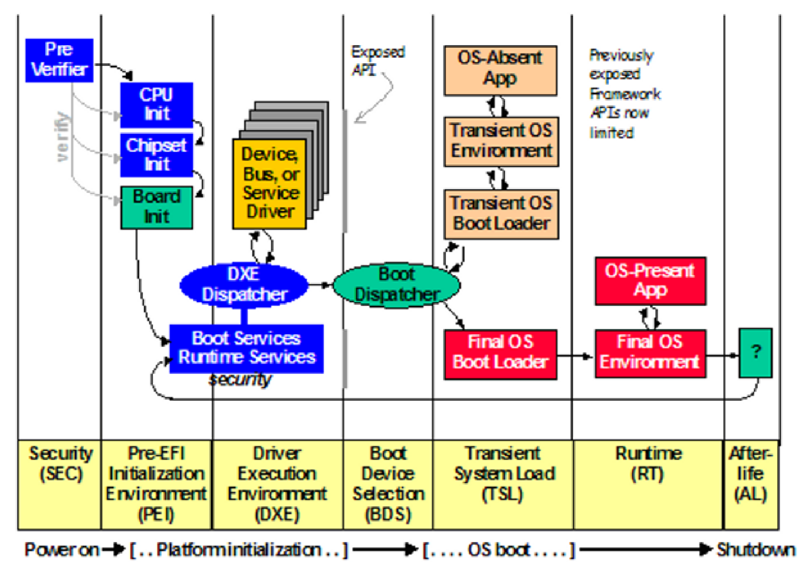

# ***🐙 Bootkits***

<p align="center">
	
</p>

This folder contains a variety of UEFI Applications and DXE Runtime Drivers developed to demonstrate bootkit basic functionalities.

Each proof-of-concept is built to illustrate specific boot-stage behaviors (networking, payload staging, memory access, disk interaction, etc.) and serves as a modular step toward more complex Windows/Linux bootkits. While all source code is included, newcomers are encouraged to first understand the build process and toolchain setup.

If this is your first time working with UEFI, start by setting up your environment and then compile your first .EFI binary. You will find below both manual instructions for Windows and Linux, as well as references to automation scripts in the "Development Environment/" folder.


---
---
---


## ***📑 Table of Contents***

<ul>
	<li><a href="#firsttime">First Time?</a></li>
	<li><a href="#bootprocess">Boot Process</a></li>
<details>
	<summary>📂</summary>
	<ul>
		<li><a href="#bootprocess-windows">Windows</a></li>
<details>
		<summary>📂</summary>
		<ul>
			<li><a href="#bootprocess-windows-windowsbootprocess">Windows Boot Process</a></li>
			<li><a href="#bootprocess-windows-windowssecuritymeasures">Windows Boot Security Measures</a></li>
		</ul>
</details>
		<li><a href="#bootprocess-linux">Linux</a></li>
<details>
		<summary>📂</summary>
		<ul>
			<li><a href="#bootprocess-linux-linuxbootprocess">Linux Boot Process</a></li>
			<li><a href="#bootprocess-linux-linuxsecuritymeasures">Linux Boot Security Measures</a></li>
		</ul>
</details>
		<li><a href="#bootprocess-runtime">Runtime</a></li>
	</ul>
</details>
	<li><a href="#uefi">Unified Extensible Firmware Interface (UEFI)</a></li>
<details>
		<summary>📂</summary>
		<ul>
			<li><a href="#uefi-introduction">Introduction</a></li>
			<li><a href="#uefi-edk2">EDK2</a></li>
			<li><a href="#uefi-bootstages">Boot Stages</a></li>
		</ul>
</details>
	<li><a href="#configuringenvironmentwindows">Compiling Your First UEFI Application (Windows OS)</a></li>
<details>
		<summary>📂</summary>
		<ul>
			<li><a href="#configuringenvironmentwindows-requirements">Requirements</a></li>
			<li><a href="#configuringenvironmentwindows-workspaceinitialization">Workspace Initialization</a></li>
			<li><a href="#configuringenvironmentwindows-basetools">Build Tools (BaseTools)</a></li>
			<li><a href="#configuringenvironmentwindows-configuration">Configuration</a></li>
			<li><a href="#configuringenvironmentwindows-buildtheapplication">Build the Application</a></li>
			<li><a href="#configuringenvironmentwindows-testinginuefishell">Testing in a UEFI Shell</a></li>
			<li><a href="#configuringenvironmentwindows-automation">Automation</a></li>
		</ul>
</details>
	<li><a href="#configuringenvironmentlinux">Compiling Your First UEFI Application (Linux-based OS)</a></li>
<details>
		<summary>📂</summary>
		<ul>
			<li><a href="#configuringenvironmentlinux-requirements">Requirements</a></li>
			<li><a href="#configuringenvironmentlinux-workspaceinitialization">Workspace Initialization</a></li>
			<li><a href="#configuringenvironmentlinux-basetools">Build Tools (BaseTools)</a></li>
			<li><a href="#configuringenvironmentlinux-configuration">Configuration</a></li>
			<li><a href="#configuringenvironmentlinux-buildtheapplication">Build the Application</a></li>
			<li><a href="#configuringenvironmentlinux-testinginuefishell">Testing in a UEFI Shell</a></li>
			<li><a href="#configuringenvironmentlinux-automation">Automation</a></li>
		</ul>
</details>
</ul>


---
---
---


<div id='firsttime'/>

## ***🆕 First Time?***

<p align="center">
	
</p>

Developing a bootkit for the first time isn't just a step forward, it's a leap into the deepest layers of a system's architecture. This isn't about post-exploitation or persistence. It's about seizing control before the OS even wakes up. Here, you're not bypassing protections, you're rendering them irrelevant. But before you can bend the boot process to your will, you need to understand how it actually works.


---
---
---


<div id='bootprocess'/>

## ***🔁 Boot Process***

Every system, no matter how hardened, must start somewhere. That moment, before userland, before drivers, before the OS itself, is where trust is established. The boot process defines who gets to execute first and under what rules. If you're building a bootkit, this is your battlefield. Understanding it is the difference between crashing a system and owning it silently.


<div id='bootprocess-windows'/>

### ***🪟 Windows***

The boot process of a modern Windows machine typically follows this sequence:

<p align="center">
	
</p>

<div id='bootprocess-windows-windowsbootprocess'/>

#### ***🪟 Windows Boot Process***

Before starting to develop a bootkit that targets Windows systems, it's essential to understand the [Windows boot process](https://uefi.org/sites/default/files/resources/UEFI-Plugfest-WindowsBootEnvironment.pdf), a complex sequence of events that starts when a computer is turned on and ends when the operating system is fully loaded:

* ***Power-On Self-Test (POST)***: When you power on your PC, the BIOS/UEFI firmware performs the POST operation to verify the integrity of the hardware components and ensures that no errors exist, allowing the system to boot up correctly.
* ***UEFI Firmware Phase***: In modern systems with UEFI firmware, the UEFI phase begins after POST. UEFI initializes the hardware required for booting and then looks for a boot device (like a hard drive, SSD, CD/DVD, USB drive).
* ***Loading bootmgfw.efi (Windows Boot Manager)***: The file bootmgfw.efi is the UEFI Windows Boot Manager, stored in the EFI System Partition (ESP). The UEFI firmware loads bootmgfw.efi from the ESP. This Boot Manager is responsible for presenting boot options (if multiple operating systems or boot options are available) and managing the initial boot process.
* ***Loading winload.efi (Windows OS Loader)***: Once a boot option is selected (or automatically chosen in a single-boot system), bootmgfw.efi loads winload.efi, the Windows OS loader. winload.efi is responsible for loading the essential files needed to start Windows and preparing the system for the handoff to the Windows kernel.
* ***Loading ntoskrnl.exe (Windows NT OS Kernel)***: After the initial setup, winload.efi loads the Windows NT kernel (ntoskrnl.exe) into memory. The kernel takes over and initializes the system's core subsystems (like security, process and memory management, hardware abstraction, etc.).

This critical process serves as the foundation for a computer's startup, and Microsoft has included [measures](https://learn.microsoft.com/en-us/windows/security/operating-system-security/system-security/secure-the-windows-10-boot-process) to protect it from threats.

<p align="center">
	
</p>


<div id='bootprocess-windows-windowssecuritymeasures'/>

#### ***🔐 Windows Boot Security Measures***

* **Secure Boot (Anti-Bootkit Installation)**: [Secure Boot](https://learn.microsoft.com/en-us/windows-hardware/design/device-experiences/oem-secure-boot) is a security feature that ensures a device boots using software trusted by the manufacturer. It verifies the digital signature of the boot loaders to prevent unauthorized applications from running during the boot process. Secure Boot uses a set of keys (PK, KEK, db, dbx) to manage this verification process, allowing only signed software to execute.
* **Early Launch AntiMalware - ELAM (Anti-Rootkit Installation)**: The [Early Launch AntiMalware](https://learn.microsoft.com/en-us/windows-hardware/drivers/install/early-launch-antimalware) feature allows anti-malware software to start before all other drivers. This early start ensures that the anti-malware software can check and verify the integrity of startup drivers and services, helping to prevent malware from executing at the earliest possible point in the boot process.
* **Driver Signature Enforcement - DSE (Anti-Rootkit Installation)**: [Driver Signature Enforcement](https://learn.microsoft.com/en-us/windows-hardware/drivers/install/driver-signing) is a security feature that ensures only drivers signed by a trusted authority can be loaded into the Windows operating system. This helps prevent the installation of drivers that could be malicious or unstable, thereby maintaining system integrity and stability.
* **Driver Blocklist for Vulnerable Drivers - (Anti-Rootkit Installation via BYOVD)**: [Driver Blocklist](https://learn.microsoft.com/en-us/windows/security/application-security/application-control/app-control-for-business/design/microsoft-recommended-driver-block-rules) prevents the loading of known vulnerable drivers exploited in [BYOVD](https://blogs.vmware.com/security/2023/04/bring-your-own-backdoor-how-vulnerable-drivers-let-hackers-in.html) (Bring Your Own Vulnerable Driver) attacks. This feature ensures system integrity by blocking outdated or compromised drivers, even if signed, using technologies like HVCI and WDAC, providing an additional layer of kernel-level security.
* **Kernel Patch Protection - Patchguard (Anti-Rootkit Deep Funcionalities)**: Kernel Patch Protection, also known as Patchguard, is a feature in 64-bit versions of Windows that prevents unauthorized modification of the Windows kernel. This security measure helps protect the kernel from rootkits and other forms of malware that attempt to insert malicious code into the kernel space.
* **Virtualization Based Security - VBS (Global)**: [Virtualization Based Security](https://learn.microsoft.com/en-us/windows-hardware/design/device-experiences/oem-vbs) uses hardware virtualization features to create and isolate a secure region of memory from the normal operating system. VBS can help protect Windows from vulnerabilities in the operating system and from malicious software that attempts to tamper with the kernel and system processes. This secure environment is used to host several security solutions, such as [Credential Guard](https://learn.microsoft.com/en-us/windows/security/identity-protection/credential-guard/), providing enhanced protection against advanced security threats.


---


<div id='bootprocess-linux'/>

### ***🐧 Linux***

The boot process of a modern Linux machine typically follows this sequence:

<p align="center">
	
</p>


<div id='bootprocess-linux-linuxbootprocess'/>

#### ***🐧 Linux Boot Process***

Before developing bootkits targeting Linux-based systems, it's crucial to understand the Linux boot process, a sequence that spans from firmware initialization to full kernel control. A clear understanding of this flow is essential for inserting code during early boot stages or modifying control paths.

- **Power-On Self-Test (POST)**: When a machine powers on, the firmware (BIOS/UEFI) performs hardware initialization and validation.
- **UEFI Firmware Phase**: On modern systems, UEFI loads and executes the bootloader stored in the EFI System Partition (ESP). Common loaders include GRUB, systemd-boot, and rEFInd. If Secure Boot is enabled, the UEFI firmware verifies the bootloader's signature.
- **Bootloader (e.g., GRUB)**: The bootloader is responsible for presenting a boot menu and loading the Linux kernel (vmlinuz) and an optional initial RAM disk (initrd or initramfs) into memory. It also passes kernel parameters to control runtime behavior.
- **Kernel Initialization**: The kernel (vmlinuz) decompresses itself, initializes memory management, device drivers, and hardware abstraction layers. Then it mounts the initial root filesystem from the initrd/initramfs and executes /init inside it.
- **initrd/initramfs**: This temporary root filesystem is unpacked into memory and contains the essential binaries and drivers needed to prepare the real root filesystem, including handling LVM, encrypted volumes, or special storage configs. Once ready, it hands off control to the main init system.
- **User-Space Init Process**: With the real root filesystem mounted, the system launches the primary init process (commonly systemd), which brings up system services, targets, and the login interface.


<div id='bootprocess-linux-linuxsecuritymeasures'/>

#### ***🔐 Linux Boot Security Measures***

- **Secure Boot (Anti-Bootkit Installation)**: [Secure Boot](https://wiki.debian.org/SecureBoot) verifies the digital signatures of bootloaders and kernels during the early firmware stage. Most Linux distributions rely on a Microsoft-signed [shim](https://pkgs.org/download/shim) bootloader that chains trust to GRUB and the Linux kernel. This prevents unauthorized boot code from being executed, blocking unsigned bootkits at the firmware interface level.
- **GRUB Password Protection (Bootloader Tampering Prevention)**: GRUB can be configured with a password to restrict access to the boot menu and prevent manual edits or command-line access. This adds a layer of security against local tampering with kernel parameters or alternate boot entries, which could be used to bypass security policies.
- **Kernel Lockdown Mode (Anti-Rootkit Installation)**: When Secure Boot is enabled, the Linux kernel can enforce [lockdown mode](https://man7.org/linux/man-pages/man7/kernel_lockdown.7.html), which restricts operations such as loading unsigned kernel modules or accessing kernel memory interfaces. This limits the attack surface for rootkits and low-level malware in Secure Boot environments.
- **Initrd Signature & Integrity Verification (Anti-Initrd Tampering)**: Tools like dracut, initramfs-tools, or UKI (Unified Kernel Image) allow embedding cryptographic hashes or signatures into the initrd/initramfs image. These mechanisms help verify the integrity of the early userspace, blocking tampered init environments that could be used for early-stage persistence.
- **Module Signing Enforcement (Anti-Rootkit Installation)**: Linux supports cryptographic signing of kernel modules. When configured with CONFIG_MODULE_SIG_FORCE=y, only modules signed with a trusted key may be loaded into the kernel. This enforces trust boundaries within the kernel and helps prevent unauthorized rootkit deployment via .ko files.
- **Kernel Self-Protection Project - KSPP (Global Kernel Hardening)**: The [KSPP](https://kspp.github.io/) is an ongoing initiative to strengthen the Linux kernel against exploitation. It introduces features that raise the bar for attackers trying to gain reliable kernel-level code execution.


---


<div id='bootprocess-runtime'/>

### ***🕒 Runtime***

Once a system is powered on, the firmware takes full control and begins executing code stored in the UEFI firmware. This initial control determines what happens during the boot process.

In most cases, the UEFI application launched from firmware is an OS loader, responsible for initializing the environment the operating system needs, loading the kernel into memory, and finally transferring execution to the kernel. However, it's important to remember that the loader is just another UEFI application: it operates within the constraints of the memory and services granted by the firmware.

Up until the end of the DXE phase, the firmware maintains authority over the system. But at a certain point, the operating system must take over. This transition occurs when the OS loader invokes the ExitBootServices() function.

When ExitBootServices() is called, the UEFI firmware transfers control of the system to the OS loader. At that moment, all boot services are shut down, any memory allocated for boot services is reclaimed, and only runtime services remain accessible. From then on, the firmware no longer plays an active role in system execution, aside from exposing limited runtime services such as variable storage or real-time clock access.

~ [WikiLeaks](https://wikileaks.org/ciav7p1/cms/page_36896783.html)

With this in mind, we can develop a DXE Runtime Driver to implement services that remain functional after the operating system has taken over. This allows us to maintain low-level presence beyond the boot process and extend UEFI capabilities deep into runtime, enabling advanced features, backdoor mechanisms, or extended persistence techniques even when the system appears fully operational.


---
---
---


<div id='uefi'/>

## ***🧬 Unified Extensible Firmware Interface (UEFI)***

There's a concept that keeps showing up at every stage of the boot process, no matter the OS, the distribution, or the architecture. UEFI. Whether it's verifying signatures, handing off to the bootloader, or enforcing Secure Boot policies, UEFI is everywhere. And yet, up to this point, we've only brushed against it. It's time to pause, zoom in, and understand exactly what UEFI is, and why it's the foundation for everything that follows.

<p align="center">
	
</p>

<div id='uefi-introduction'/>

### ***📘 Introduction***

[UEFI](https://wiki.osdev.org/UEFI) is a [specification](https://uefi.org/specifications) for x86, x86-64, ARM, and Itanium platforms that defines a software interface between the operating system and the platform firmware/BIOS.

The UEFI firmware loads a UEFI application (a relocatable [PE](https://learn.microsoft.com/en-us/windows/win32/debug/pe-format) executable file of arbitrary size) from a FAT partition on a GPT or MBR partitioned boot device to an address dynamically chosen at run-time. Subsequently, it invokes the main entry point of that application.

When UEFI firmware calls the entry point function of a UEFI application, it provides a "System Table" structure, which contains pointers to all of the system's [ACPI](https://uefi.org/specs/ACPI/6.5/) (Advanced Configuration and Power Interface) tables, memory map, and other information relevant to an operating system.

The UEFI firmware establishes many callable functions in memory, organized into sets known as "protocols," discoverable through the System Table. An important aspect to note is that each function's behavior, within each protocol, is defined by specification.

Additionally, UEFI applications have the capability to define their own protocols and persist them in memory for other UEFI applications to use. These functions adhere to a standardized and modern calling convention supported by many C compilers.

UEFI applications can be developed in any language that can be compiled and linked into a PE executable file and supports the calling convention used to access functions established in memory by the UEFI firmware. In practice, this typically involves one of three development environments: [POSIX-UEFI](https://gitlab.com/bztsrc/posix-uefi), [GNU-EFI](https://sourceforge.net/projects/gnu-efi/) or [EDK2](https://github.com/tianocore/edk2).


<div id='uefi-edk2'/>

### ***🧰 EDK2***

[EDK2](https://wiki.osdev.org/EDK2) is the official development environment for UEFI applications and also has tools for UEFI driver developers. It is developed by the open-source [Tianocore](https://www.tianocore.org/) project, of which Intel, HP, and Microsoft are the primary contributors.


<div id='uefi-bootstages'/>

### ***🪜 Boot Stages***

UEFI encompasses six primary boot phases, which are all critical in the initialization process of the platform. These collectively form what is known as [Platform Initialization](https://uefi.org/specs/PI/1.9/) (PI):

* ***Security Phase (SEC)***: The Security Phase is the initial stage of the UEFI boot process. It typically contains minimal assembly code specific to the architecture. Its primary function is to ensure the integrity and authenticity of the UEFI firmware before executing it. During this phase, temporary memory is initialized and it serves as the root of trust in the system.
* ***Pre-EFI Initialization (PEI)***: The Pre-EFI Initialization stage follows SEC, leveraging the CPU's existing resources to manage Pre-EFI Initialization Modules (PEIMs). These PEIMs are responsible for handling critical hardware initialization tasks, such as configuring main memory in a process known as CAR (Cache as RAM). Additionally, this phase facilitates the transition of control to the Driver Execution Environment (DXE).
* ***Driver Execution Environment (DXE)***: DXE is the next phase, where the majority of the system initialization occurs. At this point, main memory is accessible, so CPU, chipset, mainboard, and other I/O devices are initialized. During this stage, hardware drivers, runtime services, and any boot services required for the operating system to start, are loaded.
* ***Boot Device Select (BDS)***: BDS represents the phase where boot devices are initialized. During BDS, UEFI drivers or Option ROMs for PCI devices are executed according to the system's configuration. This phase is responsible for processing boot options and selecting the appropriate boot device. The selected boot entry is then loaded and executed in preparation for the Transient System Load (TSL).
* ***Transient System Load (TSL)***: TSL serves as the stage between boot device selection and the hand-off to the operating system.
During this phase, it's possible to launch an UEFI application like a shell or a boot loader that takes the responsibility of ending the UEFI Boot Services by making the [ExitBootServices()](https://uefi.org/specs/UEFI/2.11/07_Services_Boot_Services.html#efi-boot-services-exitbootservice) call.
* ***Runtime (RT)***: The Runtime phase marks the hand-off to the operating system (OS) once the ExitBootServices() function is executed. In this phase, a UEFI-compatible OS takes control and is responsible for exiting boot services. This action triggers the firmware to unload unnecessary code and data, retaining only runtime services and relying on their own programs, such as kernel drivers to manage hardware devices.

<p align="center">
	
</p>


---
---
---


<div id='configuringenvironmentwindows'/>

## ***🪟 Configuring the Environment and Compiling Your First UEFI Application (Windows OS)***

Before diving into the development of bootkits, it's essential to build a solid understanding of how to write and compile basic UEFI applications. This section walks you through the manual setup process using [EDK2 on Windows](https://github.com/tianocore/tianocore.github.io/wiki/Windows-systems). Mastering these steps will help you gain confidence in the internals of UEFI development, before leveraging the automation tools provided in the Environment/ directory.


<div id='configuringenvironmentwindows-requirements'/>

### ***🧰 Requirements***

To set up a working UEFI development environment with EDK2 on Windows, the following components are required:

- **Machines**: Download a [Windows 10](https://www.microsoft.com/en-us/software-download/windows10) or [Windows 11](https://www.microsoft.com/en-us/software-download/windows11) ISO image and set up a virtual machine using [VirtualBox](https://www.virtualbox.org/) or [VMware Workstation](https://www.vmware.com/products/desktop-hypervisor/workstation-and-fusion), configuring it with 70 GB of storage and 8 gigabytes of RAM.
- **Visual Studio 2019 Community**: Download [Visual Studio 2019 Community](https://visualstudio.microsoft.com/vs/older-downloads/) and, before installing, make sure to select the "[Desktop development with C++](https://learn.microsoft.com/en-us/cpp/build/vscpp-step-0-installation?view=msvc-160)" workload.
- **Git**: Install [Git](https://git-scm.com/) by downloading the appropriate [binary](https://git-scm.com/download/win).
- **Python**: Install [Python37](https://www.python.org/downloads/release/python-370/) or a later [version](https://www.python.org/) and set the PYTHON_HOME environment variable (set PYTHON_HOME=C:\Python37).
- **NASM Open Source Assembly Compiler**: To [setup](https://github.com/tianocore/tianocore.github.io/wiki/Nasm-Setup) NASM, download the binary from the [website](https://www.nasm.us/), install it in the C:\nasm\ directory, and configure the environment variable "NASM_PREFIX" (set NASM_PREFIX=C:\nasm\).
- **ACPI Source Language (ASL) Compiler**: To [setup](https://github.com/tianocore/tianocore.github.io/wiki/Asl-Setup) ASL, download the [Windows Binary Tools](https://www.intel.com/content/www/us/en/download/774881/acpi-component-architecture-downloads-windows-binary-tools.html) release package and place the unzipped content "iasl.exe" into the "C:\ASL" directory (create it if it doesn't exist).


<div id='configuringenvironmentwindows-workspaceinitialization'/>

### ***🗂️ Workspace Initialization***

Use [PowerShell](https://learn.microsoft.com/en-us/powershell/scripting/learn/ps101/01-getting-started?view=powershell-7.4) to clone the EDK2 repository and initialize submodules:

```
cd C:\
git clone https://github.com/tianocore/edk2.git
cd edk2
git submodule update --init
cd ..
```


<div id='configuringenvironmentwindows-basetools'/>

### ***🛠️ Build Tools (BaseTools)***

Open CMD and run:

```
edksetup.bat Rebuild
```

This will build EDK2 BaseTools and copy default config templates from BaseTools/Conf to the Conf/ directory.


<div id='configuringenvironmentwindows-configuration'/>

### ***⚙️ Configuration***

Open the file [edk2\Conf\target.txt](https://github.com/tianocore/edk2/blob/master/BaseTools/Conf/target.template) and modify the values of the architecture, compiler, and platform variables:
* TARGET_ARCH = X64 # 64 bits
* [TOOL_CHAIN_TAG](https://github.com/tianocore/tianocore.github.io/wiki/Windows-systems-ToolChain-Matrix) = VS2019 # Visual Studio 2019
* ACTIVE_PLATFORM = MdeModulePkg/MdeModulePkg.dsc # Complete UEFI wrapper library


<div id='configuringenvironmentwindows-buildtheapplication'/>

### ***🧪 Build the Application***

After successfully establishing the foundational structure of EDK2, the process of [bulding UEFI applications](https://github.com/tianocore/tianocore.github.io/wiki/Getting-Started-Writing-Simple-Application) becomes remarkably straightforward:

- Create a directory that contains the application.
	```
	cd edk2
	mkdir MyFirstUefiApplication
	```

-  Create at least the following files:
	- [MyFirstUefiApplication.c](https://github.com/tianocore/tianocore.github.io/wiki/Getting-Started-Writing-MyHelloWorld.c): the source code.
	- [MyFirstUefiApplication.inf](https://github.com/tianocore/tianocore.github.io/wiki/Getting-Started-Writing-MyHelloWorld.inf): the module descriptor.

To compile the .efi binary from this code:

- Edit an existing platform .DSC file (e.g., MdeModulePkg.dsc located at C:\edk2\MdeModulePkg\MdeModulePkg.dsc) and add your application's .inf entry under the Components section.
	```
	[Components]
	MyFirstUefiApplication/MyFirstUefiApplication.inf
	```

- Open a command prompt and run the setup and build commands:

	```
	edksetup.bat Rebuild
	build
	```

- The compiled .efi file will be located at:

	```
	edk2\Build\MdeModulePkg\DEBUG_VS2019\X64
	```

At this stage, you're injecting your application into an existing build package (MdeModulePkg). Once you're familiar with the process and structure, you can later define your own platform package from scratch, but for now, using a predefined one helps you focus on the actual UEFI logic rather than the surrounding configuration complexity.


<div id='configuringenvironmentwindows-testinginuefishell'/>

### ***💻 Testing in a UEFI Shell***

Once the .efi binary has been compiled, you can test its execution within a UEFI shell environment. There are two typical scenarios depending on whether you're operating inside a virtual machine or accessing it externally.

- If you're inside a Virtual Machine (VM):

	- Mount the EFI System Partition (ESP):
		```
		mountvol M: /S
		```

	- Copy your compiled UEFI application:
		```
		mkdir M:\EFI\Boot\Bootkits
		copy C:\edk2\Build\MdeModulePkg\DEBUG_VS2019\X64\MyFirstUefiApplication.efi M:\EFI\Boot\Bootkits\
		```

	- Dismount the partition once the file is in place:
		```
		mountvol M: /D
		```

	- Shut down the VM. Then:
		```
		Right-click the VM -> Power -> Power On to Firmware -> EFI Internal Shell
		```

	- Inside the UEFI Shell:
		```
		Enter
		Shell> map -r
		Shell> fs0:
		Shell> cd EFI\Boot\Bootkits
		Shell> MyFirstUefiApplication.efi
		```

- If you're testing from outside the VM (host system):

	- Create a shared folder between the host and the VM.

	- Place your .efi binary inside the shared folder.

	- Boot the VM directly into UEFI firmware:
		```
		Right-click the VM -> Power -> Power On to Firmware -> EFI Internal Shell
		```

	- From the UEFI Internal Shell:
		```
		Enter
		Shell> map -r
		Shell> fs0:
		Shell> cd EFI\Boot\Bootkits
		Shell> cp fsnt0:\MyFirstUefiApplication.efi .
		Shell> dir
		Shell> MyFirstUefiApplication.efi
		```


<div id='configuringenvironmentwindows-automation'/>

### ***🤖 Automation***

To simplify the process of establishing a Bootkit & Rootkit development environment on Windows, a corresponding PowerShell script [Setup_Development_Environment_Windows.ps1](https://github.com/TheMalwareGuardian/Bootkits-Rootkits-Development-Environment/blob/main/Scripts/Setup_Development_Environment_Windows.ps1) has been created. This script is designed to walk you through the necessary downloads and installations.


---
---
---


<div id='configuringenvironmentlinux'/>

## ***🐧 Configuring the Environment and Compiling Your First UEFI Application (Linux-based OS)***

Before diving into the development of bootkits, it's essential to build a solid understanding of how to write and compile basic UEFI applications. This section walks you through the manual setup process using [EDK2 on Linux](https://github.com/tianocore/tianocore.github.io/wiki/Using-EDK-II-with-Native-GCC). Mastering these steps will help you gain confidence in the internals of UEFI development, before leveraging the automation tools provided in the Environment/ directory.


<div id='configuringenvironmentlinux-requirements'/>

### ***🧰 Requirements***

To set up a working UEFI development environment with EDK2 on Linux, the following packets are required:

```
sudo apt update
sudo apt install -y build-essential uuid-dev iasl nasm git python-is-python3
```


<div id='configuringenvironmentlinux-workspaceinitialization'/>

### ***🗂️ Workspace Initialization***

Begin by cloning the official EDK2 repository with its submodules:

```
mkdir -p ~/src && cd ~/src
git clone --recurse-submodules https://github.com/tianocore/edk2.git
cd edk2
```

This creates the base workspace and ensures all required packages and modules are present for UEFI development.


<div id='configuringenvironmentlinux-basetools'/>

### ***🛠️ Build Tools (BaseTools)***

The EDK2 build process relies on internal tools that must first be compiled. These tools are located in the BaseTools/ directory and must be built before you can compile UEFI applications.

To build BaseTools run:

```
make -C BaseTools
```

Once compiled, source the build environment and set the tools path:

```
export EDK_TOOLS_PATH=$PWD/BaseTools
. edksetup.sh BaseTools
```

This step initializes the workspace, sets environment variables, and prepares Conf/ with template configuration files (target.txt, tools_def.txt, etc.).


<div id='configuringenvironmentlinux-configuration'/>

### ***⚙️ Configuration***

Open the file [edk2\Conf\target.txt](https://github.com/tianocore/edk2/blob/master/BaseTools/Conf/target.template) and modify the values of the architecture, compiler, and platform variables:
* TARGET_ARCH = X64 # 64 bits
* [TOOL_CHAIN_TAG](https://github.com/tianocore/tianocore.github.io/wiki/Windows-systems-ToolChain-Matrix) = GCC5 # GCC
* ACTIVE_PLATFORM = MdeModulePkg/MdeModulePkg.dsc # Complete UEFI wrapper library


<div id='configuringenvironmentlinux-buildtheapplication'/>

### ***🧪 Build the Application***

After successfully establishing the foundational structure of EDK2, the process of [bulding UEFI applications](https://github.com/tianocore/tianocore.github.io/wiki/Getting-Started-Writing-Simple-Application) becomes remarkably straightforward:

- Create a directory that contains the application.
	```
	cd edk2
	mkdir MyFirstUefiApplication
	```

-  Create at least the following files:
	- [MyFirstUefiApplication.c](https://github.com/tianocore/tianocore.github.io/wiki/Getting-Started-Writing-MyHelloWorld.c): the source code.
	- [MyFirstUefiApplication.inf](https://github.com/tianocore/tianocore.github.io/wiki/Getting-Started-Writing-MyHelloWorld.inf): the module descriptor.

To compile the .efi binary from this code:

- Edit an existing platform .DSC file (e.g., MdeModulePkg.dsc located at ~/src/edk2/MdeModulePkg/MdeModulePkg.dsc) and add your application's .inf entry under the Components section.
	```
	[Components]
	MyFirstUefiApplication/MyFirstUefiApplication.inf
	```

- Open a command prompt and run the setup and build commands:

	```
	build
	```

- The compiled .efi file will be located at:

	```
	edk2\Build\MdeModulePkg\DEBUG_GCC5\X64
	```

At this stage, you're injecting your application into an existing build package (MdeModulePkg). Once you're familiar with the process and structure, you can later define your own platform package from scratch, but for now, using a predefined one helps you focus on the actual UEFI logic rather than the surrounding configuration complexity.


<div id='configuringenvironmentlinux-testinginuefishell'/>

### ***💻 Testing in a UEFI Shell***

Once the .efi binary has been compiled, you can test its execution within a UEFI shell environment. There are two typical scenarios depending on whether you're operating inside a virtual machine or accessing it externally.

- If you're inside a Virtual Machine (VM):

	- Copy the compiled UEFI application into the EFI System Partition (ESP):
		```
		sudo mkdir -p /boot/efi/EFI/Bootkits
		sudo cp ~/src/edk2/Build/MdeModulePkg/DEBUG_GCC5/X64/MyFirstUefiApplication.efi /boot/efi/EFI/Bootkits/
		```

	- Shut down the VM and power it on directly into firmware:
		```
		Right-click the VM -> Power -> Power On to Firmware -> EFI Internal Shell
		```

	- Inside the UEFI Shell:
		```
		Enter
		Shell> map -r
		Shell> fs0:
		Shell> cd EFI\Boot\Bootkits
		Shell> MyFirstUefiApplication.efi
		```

- If you're testing from outside the VM (host system):

	- Create a shared folder between the host and the VM.

	- Place your .efi binary inside the shared folder.

	- Boot the VM directly into UEFI firmware:
		```
		Right-click the VM -> Power -> Power On to Firmware -> EFI Internal Shell
		```

	- From the UEFI Internal Shell:
		```
		Enter
		Shell> map -r
		Shell> fs0:
		Shell> cd EFI\Boot\Bootkits
		Shell> cp fsnt0:\MyFirstUefiApplication.efi .
		Shell> dir
		Shell> MyFirstUefiApplication.efi
		```


<div id='configuringenvironmentlinux-automation'/>

### ***🤖 Automation***

To simplify the process of establishing a Bootkit & Rootkit development environment on Linux, a corresponding Bash script [Setup_Development_Environment_Linux.sh](https://github.com/TheMalwareGuardian/Bootkits-Rootkits-Development-Environment/blob/main/Scripts/Setup_Development_Environment_Linux.sh) has been created. This script is designed to walk you through the necessary downloads and installations.
