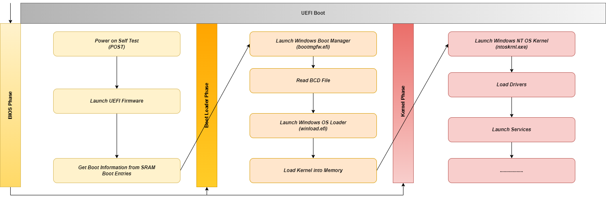
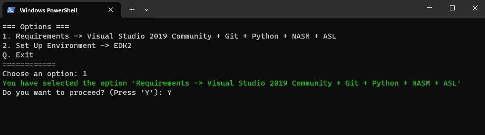
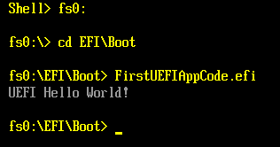
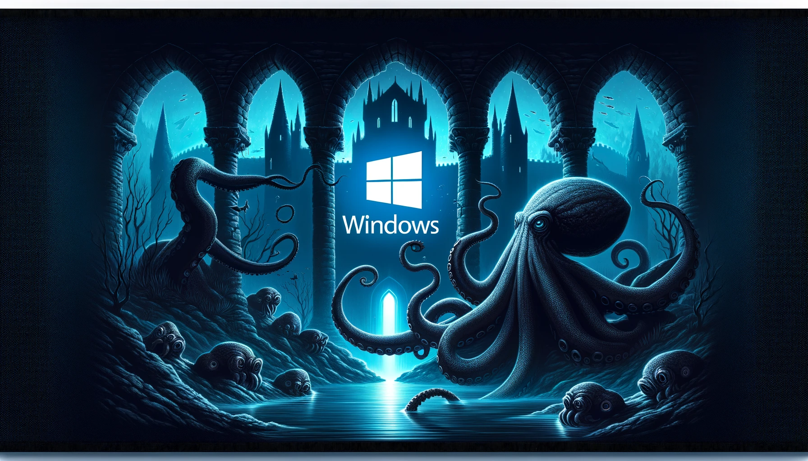
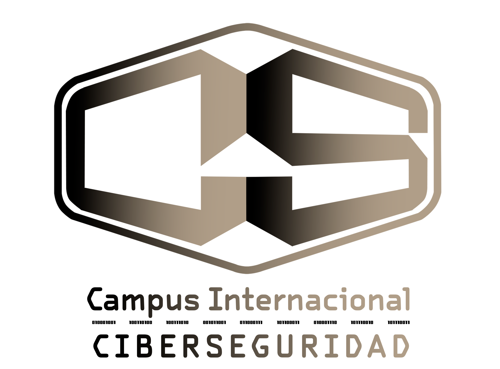

<p align="center">
  
</p>


## Table of Contents

* [Overview](#overview)
* [What is a Bootkit?](#whatisabootkit)
* [Windows Boot Process](#windowsbootprocess)
* [Security Measures](#securitymeasures)
* [Unified Extensible Firmware Interface (UEFI)](#uefi)
* [Building an EDK2 UEFI application (Windows)](#buildinganedk2uefiapplicationwindows)
* [UEFI Code in Runtime](#ueficodeinruntime)
* [Abismo UEFI Windows Bootkit](#abismouefiwindowsbootkit)
* [Videos](#videos)
* [Resources](#resources)
* [Master's Degree](#mastersdegree)


<div id='overview'/>

## Overview

Abismo is a comprehensive project thoroughly designed with the explicit goal of establishing a robust foundation for the development of bootkits. By offering a centralized repository of knowledge, Abismo stands as a valuable initiative for anyone looking to contribute to and benefit from the collective understanding of this field. However, it is imperative to underscore that Abismo is not a tool intended for malicious purposes; rather, it is a carefully constructed initiative for educational exploration and practical insights.

Abismo's significance extends beyond its basic functionality within Windows environments; it serves as a gateway for individuals venturing into the intricate and advanced field of bootkit development.


<div id='whatisabootkit'/>

## What is a Bootkit?

"Bootkits are a type of modern malware used by a threat actor to attach malicious software to a computer system. Bootkits can be a critical security threat to your business and often involve rootkit tools for evading detection. These attacks target the Unified Extensible Firmware Interface (UEFI), software that connects a PC’s operating system with its device firmware". ~ [CrowdStrike](https://www.crowdstrike.com/cybersecurity-101/malware/bootkit/)

Essentially, a bootkit is a form of malicious software strategically designed to target a computer's operating system boot process. Put plainly, a bootkit is a rootkit that loads before the operating system.

In the case of Abismo, this manifests as a specialized focus on the complexities inherent in developing UEFI applications and DXE drivers.


<div id='windowsbootprocess'/>

## Windows Boot Process

Before starting to develop a bootkit that targets Windows systems, it's essential to understand the [Windows boot process](https://uefi.org/sites/default/files/resources/UEFI-Plugfest-WindowsBootEnvironment.pdf), a complex sequence of events that starts when a computer is turned on and ends when the operating system is fully loaded:

* ***Power-On Self-Test (POST)***: When you power on your PC, the BIOS/UEFI firmware performs the POST operation to verify the integrity of the hardware components and ensures that no errors exist, allowing the system to boot up correctly.
* ***UEFI Phase (UEFI)***: In modern systems with UEFI firmware, the UEFI phase begins after POST. UEFI initializes the hardware required for booting and then looks for a boot device (like a hard drive, SSD, CD/DVD, USB drive).
* ***Loading bootmgfw.efi (Windows Boot Manager)***: The file bootmgfw.efi is the UEFI Windows Boot Manager, stored in the EFI System Partition (ESP). The UEFI firmware loads bootmgfw.efi from the ESP. This Boot Manager is responsible for presenting boot options (if multiple operating systems or boot options are available) and managing the initial boot process.
* ***Loading winload.efi (OS Loader)***: Once a boot option is selected (or automatically chosen in a single-boot system), bootmgfw.efi loads winload.efi, the Windows OS loader. winload.efi is responsible for loading the essential files needed to start Windows and preparing the system for the handoff to the Windows kernel.
* ***Loading ntoskrnl.exe (NT OS Kernel)***: After the initial setup, winload.efi loads the Windows NT kernel (ntoskrnl.exe) into memory. The kernel takes over and initializes the system's core subsystems (like security, process and memory management, hardware abstraction, etc.).

<p align="center">
  
</p>

This critical process serves as the foundation for a computer's startup, and Microsoft has included [measures](https://learn.microsoft.com/en-us/windows/security/operating-system-security/system-security/secure-the-windows-10-boot-process) to protect it from threats.

<p align="center">
  
</p>


<div id='securitymeasures'/>

## Security Measures

* **Secure Boot (Anti-Bootkit Installation)**: [Secure Boot](https://learn.microsoft.com/en-us/windows-hardware/design/device-experiences/oem-secure-boot) is a security feature that ensures a device boots using software trusted by the manufacturer. It verifies the digital signature of the boot loaders to prevent unauthorized applications from running during the boot process. Secure Boot uses a set of keys (PK, KEK, db, dbx) to manage this verification process, allowing only signed software to execute.
* **Driver Signature Enforcement - DSE (Anti-Rootkit Installation)**: [Driver Signature Enforcement](https://learn.microsoft.com/en-us/windows-hardware/drivers/install/driver-signing) is a security feature that ensures only drivers signed by a trusted authority can be loaded into the Windows operating system. This helps prevent the installation of drivers that could be malicious or unstable, thereby maintaining system integrity and stability.
* **Kernel Patch Protection - Patchguard (Anti-Rootkit Deep Funcionalities)**: Kernel Patch Protection, also known as Patchguard, is a feature in 64-bit versions of Windows that prevents unauthorized modification of the Windows kernel. This security measure helps protect the kernel from rootkits and other forms of malware that attempt to insert malicious code into the kernel space.
* **Early Launch AntiMalware - ELAM (Anti-Rootkit Installation)**: The [Early Launch AntiMalware](https://learn.microsoft.com/en-us/windows-hardware/drivers/install/early-launch-antimalware) feature allows anti-malware software to start before all other drivers. This early start ensures that the anti-malware software can check and verify the integrity of startup drivers and services, helping to prevent malware from executing at the earliest possible point in the boot process.
* **Virtualization Based Security - VBS (Global)** - [Virtualization Based Security](https://learn.microsoft.com/en-us/windows-hardware/design/device-experiences/oem-vbs) uses hardware virtualization features to create and isolate a secure region of memory from the normal operating system. VBS can help protect Windows from vulnerabilities in the operating system and from malicious software that attempts to tamper with the kernel and system processes. This secure environment is used to host several security solutions, such as [Credential Guard](https://learn.microsoft.com/en-us/windows/security/identity-protection/credential-guard/), providing enhanced protection against advanced security threats.


<div id='uefi'/>

## Unified Extensible Firmware Interface (UEFI)


### Introduction

[UEFI](https://wiki.osdev.org/UEFI) is a [specification](https://uefi.org/specifications) for x86, x86-64, ARM, and Itanium platforms that defines a software interface between the operating system and the platform firmware/BIOS.

The UEFI firmware loads a UEFI application (a relocatable [PE](https://learn.microsoft.com/en-us/windows/win32/debug/pe-format) executable file of arbitrary size) from a FAT partition on a GPT or MBR partitioned boot device to an address dynamically chosen at run-time. Subsequently, it invokes the main entry point of that application.

When UEFI firmware calls the entry point function of a UEFI application, it provides a "System Table" structure, which contains pointers to all of the system's [ACPI](https://uefi.org/specs/ACPI/6.5/) (Advanced Configuration and Power Interface) tables, memory map, and other information relevant to an operating system.

The UEFI firmware establishes many callable functions in memory, organized into sets known as "protocols," discoverable through the System Table. An important aspect to note is that each function's behavior, within each protocol, is defined by specification.

Additionally, UEFI applications have the capability to define their own protocols and persist them in memory for other UEFI applications to use. These functions adhere to a standardized and modern calling convention supported by many C compilers.

UEFI applications can be developed in any language that can be compiled and linked into a PE executable file and supports the calling convention used to access functions established in memory by the UEFI firmware. In practice, this typically involves one of three development environments: [POSIX-UEFI](https://gitlab.com/bztsrc/posix-uefi), [GNU-EFI](https://sourceforge.net/projects/gnu-efi/) or [EDK2](https://github.com/tianocore/edk2).


### EDK2

[EDK2](https://wiki.osdev.org/EDK2) is the official development environment for UEFI applications and also has tools for UEFI driver developers. It is developed by the open-source [Tianocore](https://www.tianocore.org/) project, of which Intel, HP, and Microsoft are the primary contributors.


### Boot Stages

UEFI encompasses six primary boot phases, which are all critical in the initialization process of the platform. These collectively form what is known as [Platform Initialization](https://uefi.org/specs/PI/1.8/index.html) (PI):

* ***Security Phase (SEC)***: The Security Phase is the initial stage of the UEFI boot process. It typically contains minimal assembly code specific to the architecture. Its primary function is to ensure the integrity and authenticity of the UEFI firmware before executing it. During this phase, temporary memory is initialized and it serves as the root of trust in the system.
* ***Pre-EFI Initialization (PEI)***: The Pre-EFI Initialization stage follows SEC, leveraging the CPU's existing resources to manage Pre-EFI Initialization Modules (PEIMs). These PEIMs are responsible for handling critical hardware initialization tasks, such as configuring main memory in a process known as CAR (Cache as RAM). Additionally, this phase facilitates the transition of control to the Driver Execution Environment (DXE).
* ***Driver Execution Environment (DXE)***: DXE is the next phase, where the majority of the system initialization occurs. At this point, main memory is accessible, so CPU, chipset, mainboard, and other I/O devices are initialized. During this stage, hardware drivers, runtime services, and any boot services required for the operating system to start, are loaded.
* ***Boot Device Select (BDS)***: BDS represents the phase where boot devices are initialized. During BDS, UEFI drivers or Option ROMs for PCI devices are executed according to the system's configuration. This phase is responsible for processing boot options and selecting the appropriate boot device. The selected boot entry is then loaded and executed in preparation for the Transient System Load (TSL).
* ***Transient System Load (TSL)***: TSL serves as the stage between boot device selection and the hand-off to the operating system.
During this phase, it's possible to launch an UEFI application like a shell or a boot loader that takes the responsibility of ending the UEFI Boot Services by making the [ExitBootServices()](https://uefi.org/specs/UEFI/2.9_A/07_Services_Boot_Services.html#efi-boot-services-exitbootservices) call.
* ***Runtime (RT)***: The Runtime phase marks the hand-off to the operating system (OS) once the ExitBootServices() function is executed. In this phase, a UEFI-compatible OS takes control and is responsible for exiting boot services. This action triggers the firmware to unload unnecessary code and data, retaining only runtime services and relying on their own programs, such as kernel drivers to manage hardware devices.

<p align="center">
  
</p>


<div id='buildinganedk2uefiapplicationwindows'/>

## Building an EDK2 UEFI application (Windows)


### Requirements

To set up the necessary environment for UEFI application development using EDK2 on [Windows](https://github.com/tianocore/tianocore.github.io/wiki/Windows-systems), the following virtual machines (VMs), tools, and packages are essential:


* **Machines**: Download a [Windows 10](https://www.microsoft.com/en-us/software-download/windows10) or [Windows 11](https://www.microsoft.com/en-us/software-download/windows11) ISO image and set up a virtual machine using [VirtualBox](https://www.virtualbox.org/) or [VMware Workstation](https://www.vmware.com/products/workstation-pro/workstation-pro-evaluation.html), configuring it with 70 GB of storage and 8 gigabytes of RAM.
* **Visual Studio 2019 Community**: Download [Visual Studio 2019 Community](https://visualstudio.microsoft.com/thank-you-downloading-visual-studio/?sku=Community&rel=16) and, before installing, make sure to select the "[Desktop development with C++](https://learn.microsoft.com/en-us/cpp/build/vscpp-step-0-installation?view=msvc-160)" workload.
* **Git**: Install [Git](https://git-scm.com/) by downloading the appropriate [binary](https://git-scm.com/download/win).
* **Python**: Install [Python37](https://www.python.org/downloads/release/python-370/) or a later [version](https://www.python.org/) and set the PYTHON_HOME environment variable (set PYTHON_HOME=C:\Python37).
* **NASM Open Source Assembly Compiler**: To [setup](https://github.com/tianocore/tianocore.github.io/wiki/Nasm-Setup) NASM, download the binary from the [website](https://www.nasm.us/), install it in the C:\nasm\ directory, and configure the environment variable "NASM_PREFIX" (set NASM_PREFIX=C:\nasm\).
* **ACPI Source Language (ASL) Compiler**: To [setup](https://github.com/tianocore/tianocore.github.io/wiki/Asl-Setup) ASL, download the [Windows Binary Tools](https://www.intel.com/content/www/us/en/download/774881/acpi-component-architecture-downloads-windows-binary-tools.html) release package and place the unzipped content "iasl.exe" into the "C:\ASL" directory (create it if it doesn't exist).

### Workspace

Execute the commands in a [PowerShell](https://learn.microsoft.com/en-us/powershell/scripting/learn/ps101/01-getting-started?view=powershell-7.4) to complete the setup of the environment:

```
git clone https://github.com/tianocore/edk2.git
cd edk2
git submodule update --init
cd ..
```

### BaseTools

Open a CMD prompt and execute the command '*edksetup.bat Rebuild*'. This process may take several minutes.

This will compile the EDK2 build tools into edk2\BaseTools\Bin\Win32 and copy the default configuration templates from edk2\BaseTools\Conf to edk2\Conf.

### Configuration

Open the file [edk2\Conf\target.txt](https://github.com/tianocore/edk2/blob/master/BaseTools/Conf/target.template) and modify the values of the architecture, compiler, and platform variables:
* TARGET_ARCH = X64 # 64 bits
* [TOOL_CHAIN_TAG](https://github.com/tianocore/tianocore.github.io/wiki/Windows-systems-ToolChain-Matrix) = VS2019 # Visual Studio 2019
* ACTIVE_PLATFORM = MdeModulePkg/MdeModulePkg.dsc # Complete UEFI wrapper library

### Script

To simplify the process of establishing a bootkit development environment on Windows, a corresponding PowerShell script [Setup_Development_Environment.ps1](Setup_Development_Environment.ps1) has been created. This script is designed to walk you through the necessary downloads and installations.

<p align="center">
    
</p>


### Project

After successfully establishing the foundational structure of EDK2, the process of [bulding UEFI applications](https://github.com/tianocore/tianocore.github.io/wiki/Getting-Started-Writing-Simple-Application) becomes remarkably straightforward:

1. Create a directory that contains the application.
    ```
    cd edk2
    mkdir FirstUEFIApp
    ```

2. Create, at least, the files [FirstUEFIAppCode.c](https://github.com/tianocore/tianocore.github.io/wiki/Getting-Started-Writing-MyHelloWorld.c) and [FirstUEFIAppCode.inf](https://github.com/tianocore/tianocore.github.io/wiki/Getting-Started-Writing-MyHelloWorld.inf).


### Build

In order to obtain the .efi file associated with that code, simply follow these steps in an orderly manner:

1. Update an existing platform .DSC file with the project's .inf file. The application should be added to the "Components" section just before the "BuildOptions" section (e.g., FirstUEFIApp/FirstUEFIAppCode.inf).

2. Open a command-prompt and ran "*edksetup.bat*", then, again from the top-level directory, simply run "*build*".

3. The final output, an .efi file, will be located in the directory edk2/Build/MdeModulePkg/DEBUG_$(TOOL_CHAIN_TAG)/X64.


### Test

At this point, we already have the .efi application (in this case, it was a simple 'Hello, World'), and we just need to test that it works. To do this, we can mount the EFI system partition and copy the application there. Next, we restart the machine, enter the BIOS (F12), and using the UEFI shell, we execute the application.

```
mountvol M: /S
cd M:\EFI\Boot
copy C:\.....\edk2\Build\MdeModulePkg\DEBUG_$(TOOL_CHAIN_TAG)\X64\FirstUEFIAppCode.efi .
```

<p align="center">
    
</p>


<div id='ueficodeinruntime'/>

## UEFI Code in Runtime

On boot, the code located on the firmware has control of the system. It is what determines what happens during a boot.

Typically, the UEFI application run from the firmware is an OS Loader, whose main purpose is to initialize everything that the OS needs to run, load the kernel into memory, and pass control to the kernel itself. However, the loader is just another UEFI Application: it can only use the memory it has been allocated by the firmware and can only access the UEFI services and protocols that the firmware provides.

All the way through to the end of the DXE phase of a UEFI boot, the firmware is in charge. However, eventually, all of the UEFI boot services need to end, and the OS needs to take control. This is accomplished using the UEFI boot service ExitBootServices.

When ExitBootServices is called by the OS loader, the firmware gives control of the system to the loader. All of the boot service memory is reclaimed, the boot services are all terminated, and the OS loader can hand over control of the system to the OS. At this point, only the runtime services provided by the firmware are still accessible.

~ [WikiLeaks](https://wikileaks.org/ciav7p1/cms/page_36896783.html)

Bearing this in mind, we can develop a DXE Runtime Driver to establish services that remain accessible at runtime, even after the operating system has taken control. This approach allows us to leverage the UEFI Runtime phase to provide advanced functionalities or additional services, ensuring that the capabilities of the UEFI framework are utilized to support system operations once it is in execution.


<div id='abismouefiwindowsbootkit'/>

## Abismo UEFI Windows Bootkit

<p align="center">
  
</p>

The Abismo UEFI Windows Bootkit is a sophisticated piece of malware designed to infiltrate Windows systems at the most fundamental level, by targeting the boot process. Its primary mechanism of action involves patching three critical components of the Windows boot sequence: the Windows Boot Manager (bootmgfw.efi), the Windows OS Loader (winload.efi), and the Windows Kernel itself (ntoskrnl.exe).

The core objective of this bootkit is to disable Driver Signature Enforcement (DSE), a security feature that prevents unsigned drivers from being loaded into the system. By circumventing DSE, the Abismo bootkit gains the capability to install a kernel driver equipped with extensive surveillance functionalities, including a keylogger, and mechanisms to conceal malicious activities. This includes hiding files, processes, connections, and other evidence of its presence, thereby modifying the Windows kernel's code to facilitate undetected operation within the infected system.

Through these modifications, the Abismo bootkit achieves a high level of stealth and persistence, embedding itself deeply within the system's architecture. Its ability to manipulate the boot process and kernel operations allows it to carry out its malicious activities undetected by traditional antivirus and security solutions, representing a significant threat to system integrity and user privacy.

Furthermore, the Abismo UEFI Windows Bootkit incorporates functionalities observed in other notorious bootkits found in the wild, such as [ESPecter](https://www.welivesecurity.com/2021/10/05/uefi-threats-moving-esp-introducing-especter-bootkit/) and [BlackLotus](https://www.welivesecurity.com/2023/03/01/blacklotus-uefi-bootkit-myth-confirmed/), showcasing its comprehensive approach to system compromise.

It is designed to be installed on systems where Secure Boot has been disabled, or alternatively, through physical access to the target computer, a scenario commonly referred to as an "[evil maid](https://encyclopedia.kaspersky.com/glossary/evil-maid/)" attack.


### Download

```

```


### Configuration

```

```


### Build

```

```


### Installation

```

```


<div id='videos'/>

## Videos


<div id='resources'/>

## Resources

* ***[Awesome Bootkits & Rootkits Development](https://github.com/TheMalwareGuardian/Awesome-Bootkits-Rootkits-Development)***: My compilation (+100) of extensive resources dedicated to bootkit and rootkit development.


<div id='mastersdegree'/>

## Master's Degree

If you wish to acquire this knowledge, along with other topics related to malware analysis, reversing, and bug hunting, under the guidance of top-notch professionals, do not hesitate to get in touch with the institution where I am an instructor, offering a [master's degree (Máster en Reversing, Análisis de Malware y Bug Hunting)](https://www.campusciberseguridad.com/masters/master-en-reversing) in this field.


<p align="center">
  <span style="vertical-align: middle;">
    
  </span>
  <span style="vertical-align: middle;">
    
  </span>
  <span style="vertical-align: middle;">
    
  </span>
</p>


## Contact

This project represents a dedicated exploration into the intricate realm of bootkits, with a specific focus on providing a comprehensive resource for both my students and individuals embarking on their journey in this complex field.

The subject of bootkits is multifaceted, and this project serves as a starting point for understanding its nuances. It's important to acknowledge that certain aspects may assume a level of prior knowledge, while others may remain uncharted due to the inherent complexities of the subject matter.

This work is designed to offer valuable insights and resources to support your educational and developmental goals, making it suitable for anyone seeking to delve into bootkit development. If you have specific inquiries, require additional clarification, or wish to engage in collaborative efforts, please do not hesitate to get in [touch](https://www.linkedin.com/in/vazquez-vazquez-alejandro/).


## 📃 License

This project is licensed under the GNU GLPv3 License - see the [LICENSE](LICENSE) file for details.
