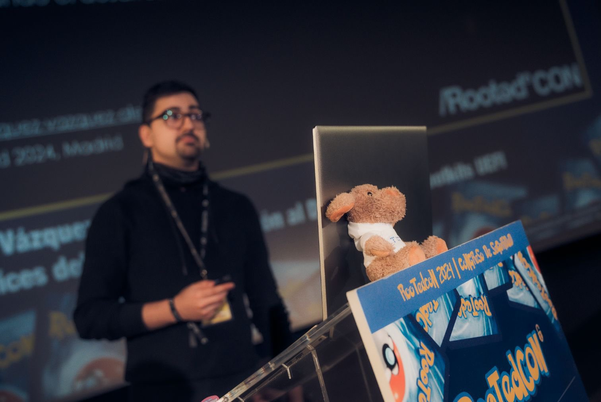

# ***🏴‍☠️ Abyss: Windows UEFI Bootkit***

	

	<i>
		Built not in a corporate lab, but by a guy in his twenties hacking from his mom's couch in a town forgotten by God. If I can tamper with the boot process of modern operating systems and write one of the most technically demanding malwares out there - what's your excuse for not building one too? You're part of a red team? Offensive security engineer? Or maybe you're just a curious threat emulation nerd looking to prove yourself? Then you already know this field isn't about theory, it's about action. Your team needs access. They need stealth. They need persistence. Dive into the abyss and build your own bootkit.
	</i>

---
---
---

## ***📑 Table of Contents***

<ul>
	<li><a href="#whatisabootkit">What is a Bootkit?</a></li>
	<li><a href="#buildyourfirstbootkit">Build Your First Bootkit</a></li>
	<li><a href="#abyssbootkit">Abyss Windows UEFI Bootkit</a></li>

	
📂

	<ul>
		<li><a href="#abyssbootkit-architecture">Architecture</a></li>
	</ul>

	<li><a href="#cybersecurityconferences">Cybersecurity Conferences</a></li>
	<li><a href="#resources">Awesome Resources</a></li>
	<li><a href="#contact">Contact</a></li>
</ul>

---
---
---

## ***🐙 What is a Bootkit?***

When you're not sure how something works, you ask those who know. And when no one knows - you reverse it, debug it, break it down, and share what you've learned so the next person doesn't have to start from zero.

- **[CrowdStrike](https://www.crowdstrike.com/cybersecurity-101/malware/bootkit/)**
	
	"Bootkits are a type of modern malware used by a threat actor to attach malicious software to a computer system. Bootkits can be a critical security threat to your business and often involve rootkit tools for evading detection. These attacks target the Unified Extensible Firmware Interface (UEFI), software that connects a PC's operating system with its device firmware".

- **[Mitre Att&ck](https://attack.mitre.org/techniques/T1542/003/)**

	"Adversaries may use bootkits to persist on systems. A bootkit is a malware variant that modifies the boot sectors of a hard drive, allowing malicious code to execute before a computer's operating system has loaded. In UEFI (Unified Extensible Firmware Interface) systems, a bootkit may instead create or modify files in the EFI system partition (ESP). The ESP is a partition on data storage used by devices containing UEFI that allows the system to boot the OS and other utilities used by the system. An adversary can use the newly created or patched files in the ESP to run malicious kernel code."

- **Demistification**

	At its core, a bootkit is simply a rootkit that executes before the operating system loads. Instead of relying on post-boot vulnerabilities or privilege escalation, a bootkit operates at the firmware level, gaining control before the kernel initializes.

	What does that mean practically?
	- In Windows, a rootkit typically takes the form of a kernel-mode driver (KMDF), a .sys file injected or loaded into the OS kernel to gain stealthy control over system behavior.
	- In Linux, rootkit functionality is commonly implemented via a Loadable Kernel Module (LKM), a .ko file injected into the kernel.

	A bootkit, in contrast, is usually a UEFI application, UEFI driver or DXE Runtime driver that loads before the operating system. Its purpose is to establish persistence, bypass early protections, and prepare or inject the platform-specific rootkit into the kernel before it has even initialized.

	So, if you're researching how to build a rootkit (a malware that hides processes, files, network connections, prevents analysis, manipulates hardware, and more), you're already halfway to building a bootkit. A bootkit is just a rootkit with pre-OS delivery mechanics, exploiting UEFI as a launchpad.

---
---
---

## ***🧪 Build Your First Bootkit***

Before diving into the core internals of Abyss, you may want to get your hands dirty building your first proof-of-concept bootkit. This project includes several minimal working examples inside the "Bootkits/" directory, each tailored to help you understand how UEFI Applications and DXE Runtime Drivers interact with system firmware during the early boot process. These samples serve as a practical foundation for writing, compiling, and testing your own malicious (or research) UEFI payloads.

If this is your first time working with UEFI, it's strongly recommended to begin by following the manual setup instructions provided in "Bootkits/". This will help you understand how the environment is built, how EDK2 works, and how UEFI binaries are compiled and tested from scratch. You'll also get to run hands-on proof-of-concepts that demonstrate the mechanics of early-boot persistence and memory tampering.

Once you're comfortable building and testing these samples, and you've gained confidence booting your own unsigned UEFI code, you can leverage the automation scripts in the "Development Environment/" folder to streamline your workflow across multiple systems or quickly rebuild your dev setup.

And once you've reached that point, when booting unsigned code feels like second nature, come back here. That was just the warm-up. The real challenge begins with the full-featured bootkit included in this project: Abyss. Dive deeper, trace the hooks, map the memory patches, and see how far down the firmware rabbit hole goes.

---
---
---

## ***🧭 Abyss Windows UEFI Bootkit***

	

Abyss (Abismo) is not just a bootkit - and it's definitely not just a repository for proof-of-concepts. It is a comprehensive offensive research project developed to centralize the study, development, and simulation of advanced bootkit techniques across both Windows and Linux platforms, with a strong emphasis on UEFI specification exploration, low-level OS tampering, and firmware-to-kernel attack chains.

This project is designed to support offensive security teams, threat researchers, and adversary simulation professionals, enabling realistic emulation of APT-grade bootkits and rootkits within controlled environments. Abyss reimplements and extends concepts inspired by real-world and academic malware such as BlackLotus, ESPecter, and Bootkitty, serving as a robust foundation for further analysis and experimentation.

Rather than focusing on one platform or single technique, Abyss is built to be a modular, extensible base for:
- Studying UEFI internals and boot service abuse.
- Developing bootkits with modular payloads and persistence strategies.
- Investigating practical firmware-to-OS attacks involving runtime drivers and functions hooks/patches.
- Experimenting with pre-boot network communication, in-memory and disk-based injection, and dynamic payload loading.

All components have been thoroughly tested on virtualized environments (VMware, QEMU) as well as on dedicated physical hardware prepared for UEFI experimentation. That said, Abyss is not a plug-and-play bootkit - it assumes you have (or want to build) the skills to adapt and extend it. Function hooking and patching mechanisms are tightly coupled to firmware/OS versions and must often be tuned manually. This may involve reverse engineering, disassembly, firmware debugging, and deep reading of the UEFI specification - thousands of pages of it.

If you're here expecting a one-click bootkit, you're in the wrong place. But if you're here to build, break, and learn, Abyss will take you far.

Abyss exists to equip red teams and security researchers with the tools and knowledge to understand how modern APTs can deploy malicious UEFI firmware implants. It is for those actively working in low-level offensive research, malware design, and boot/firmware threat emulation.

---
---
---

### ***🧩 Architecture***

Abyss follows a modular architecture designed to enable complex firmware-to-kernel attack chains, built on top of UEFI Boot Services and Runtime Services abuse through advanced hooking techniques and in-memory patching.

To better understand the functionalities that Abyss implements, it's useful to first look at the internal structure that orchestrates its execution.

The codebase is organized into modules that follow the actual execution order of the boot process, from the very first initialization steps in UEFI firmware to runtime interaction with the operating system. While these modules don't correspond one-to-one with the conceptual phases described below, they're laid out in execution order, so by following them sequentially, you'll naturally uncover the internal phases that Abyss transitions through.

The following list outlines those underlying execution phases, not as strict folder names, but as the logical flow that Abyss follows under the hood:

- **🔧 Initialization Phase**  
	Parses the bootkit configuration, allocates required memory regions, initializes internal flags, and loads auxiliary drivers. This phase lays the foundation for all subsequent behavior.

- **📡 Pre-Boot Operations Phase**  
	Uses UEFI Boot Services to perform privileged actions before the OS is loaded, including UEFI and DXE driver injection, network communication, staging of payloads either in memory or to disk, and direct reading or modification of files within accessible partitions.

- **🪝 Boot Transition Interception Phase**  
	Hooks UEFI services to hijack execution flow just before the original Windows Boot Manager takes control.

- **🧬 Windows Boot Manager Hooking Phase**  
	Gains control over the transition from firmware to the OS loader by hooking into the Windows Boot Manager, enabling execution redirection and remaining active as control is handed off to the Windows OS Loader.

- **🧷 Windows OS Loader Hooking Phase**  
	Alters the behavior of the OS loader to deploy kernel-mode rootkits directly into memory, define custom memory layouts, and prepare payloads for execution during the OS setup process.

- **🛡️ Kernel Security Patching Phase**  
	Modifies memory regions early in the OS boot process to disable protection mechanisms, allowing the system to run unsigned or tampered code.

- **🐚 Runtime Backdoor Phase (Optional)**  
	Installs a persistent DXE runtime driver that survives into OS runtime. This component allows a userland utility to read and write arbitrary kernel memory, and to inject additional payloads in-memory post-boot, offering an alternative path for deploying rootkits without modifying the bootloader.

---

Now that you understand the internal execution flow that Abyss follows across its distinct phases, we can look at the concrete capabilities that each component provides. These core functionalities are implemented across different modules and enable Abyss to perform powerful pre-boot, boot-level, and runtime operations:

- **🧠 UEFI Boot Services Abuse**
	- **🔌 Pre-Boot Ethernet Communication**  
		Establish network connections before the OS takes control, supporting payload retrieval, C2 handshake, key exchange, and lateral movement in trusted LAN environments.
	- **📦 UEFI and DXE Driver Injection**  
		Dynamically load malicious UEFI and DXE drivers into memory to extend low-level functionality - such as file system access, disk I/O, or custom protocol support - and to persist stealthy implants before the OS boots.
	- **💣 Payload Staging (RAM or Disk)**  
		Stage payloads for post-boot deployment by injecting kernel-mode drivers directly into RAM or writing them to disk for later execution.
	- **🪝 Critical Boot Flow Interception**  
		Hook services like LoadImage and ExitBootServices to hijack control flow and manipulate the boot process.
	- **🧠 Full Boot Services Exploitation**  
		Leverage boot-time services for raw memory allocation, partition enumeration, UEFI variable manipulation, and direct access to storage and network interfaces.
	- **🖼️ Tampered Boot Graphics**  
		Alter graphical output during early boot to deceive users, impersonate vendors, or simulate recovery environments.

- **⚙️ Bootloader and Loader Tampering**
	- **🧬 Windows Boot Manager Hooking (bootmgfw.efi)**  
		Hook ImgArchStartBootApplication to intercept the exact moment winload.efi is loaded, enables early execution redirection before the OS loader takes over.
	- **🧷 Windows OS Loader Function Hijacking (winload.efi)**  
		Modify internal loader functions such as BlImgAllocateImageBuffer and OslFwpKernelSetupPhase1 to:
		- Inject unsigned kernel drivers into memory.
		- Define custom memory regions for rootkit payloads.
		- Alter boot-time behavior during OS initialization.
	- **🛠️ Windows Kernel Patching (ntoskrnl.exe & CI.dll)**  
		Patch kernel memory structures and Code Integrity routines to disable security features like Driver Signature Enforcement (DSE):
		- Overwrite logic inside SeCodeIntegrityQueryInformation to bypass DSE enforcement checks.
		- Tamper with CiInitialize in CI.dll to fully disable Code Integrity during early kernel setup.
		- Enables execution of unsigned .sys drivers without enabling test-signing or exploiting kernel vulnerabilities.

- **🐚 Runtime Memory Access Backdoor**
	- **🔁 Covert Alternative to Traditional Bootkits**  
	Offers a stealthier path to system compromise, avoids modifying bootloaders while still enabling full post-boot memory control and rootkit deployment.
	- **🧬 DXE Runtime Driver Persistence**  
	A malicious DXE driver, injected pre-boot, remains resident after ExitBootServices() and continues executing as a runtime component.
	- **🔓 Userland-to-Kernel Memory Access**  
	A user-mode utility communicates with the DXE driver via EFI variables, enabling:
		- Arbitrary kernel memory read/write.
		- In-memory injection of unsigned .sys rootkits.

- **🎛️ Customizable Operator Control**
	- **🎚️ Predefined Configuration Utility**  
	Enables fine-tuned control over Abyss behavior prior to deployment, including:
		- Payload selection.
		- Target platform.
		- Persistence method.
		- Network communication, encryption settings, and both pre-boot and post-boot actions.

- **📚 Research-Driven Foundation**
	- **🧪 Emulation of Real APT Techniques**  
	Built for red teamers, threat researchers, and firmware analysts emulating modern adversary behavior at the UEFI level.
	- **📖 Internal Knowledge Base**  
	Abyss is both a toolkit and a centralized knowledge repository for UEFI internals, low-level attacks, and bootkit/rootkit development.

<!--
---
---
---

### ***🗺️ Execution Diagram***

To complement the technical breakdown of Abyss's internal architecture and capabilities, the following diagram provides a visual summary of the bootkit's execution flow.

It maps the key stages Abyss transitions through, from early firmware initialization to post-boot memory tampering, and highlights where each module or functionality comes into play during the lifecycle of the attack chain.

	

-->

---
---
---

## ***🎤 Cybersecurity Conferences***

📁 You can find all materials related to these events (slides, demos, extra resources) in the "Cybersecurity Conferences" folder of this repository.

### ***🎯 DEF CON 33, Las Vegas 2025***

***🐙 Infecting the Boot to Own the Kernel: Bootkits and Rootkits Development***

This talk marks the conclusion of a long-term research project into UEFI bootkits and kernel-mode rootkits on Windows. It consolidates every core component, from early-stage firmware compromise to post-boot memory access, into two modular and complementary frameworks: Abyss, responsible for bootkit development and early execution control, and Benthic, which handles kernel-mode stealth, persistence, and rootkit development.

After dissecting Abyss's internal architecture, the session walks through how to stealthily compromise a system from firmware to kernel using UEFI Boot Services, bootloader tampering, kernel patching, and runtime backdoors, all while bypassing protections like Driver Signature Enforcement (DSE).

In the second half of the talk, the focus shifts to Benthic, the framework dedicated to building a fully functional Windows rootkit for red team operations and stealthy persistence. It showcases advanced capabilities such as process and file hiding, keylogging, network traffic manipulation, and persistent command-and-control, all operating from kernel mode and demonstrated through live examples.

DEF CON 33 was the perfect place to conclude this stage of the project. But the road here was long. The core research behind both Abyss and Benthic was slowly shaped over the years, with many of their components publicly explored in my previous talks.

	
	 
	<em>Watch the full DEF CON 33 presentation on YouTube (coming soon)</em>

---
---
---

## ***📚 Awesome Resources***

📌 [TheMalwareGuardian: Awesome Bootkits & Rootkits Development Resources](https://github.com/TheMalwareGuardian/Awesome-Bootkits-Rootkits-Development): My compilation (+400) of extensive resources dedicated to bootkit and rootkit development.

---
---
---

## ***📨 Contact***

This project represents a dedicated exploration into the intricate realm of bootkits, with a specific focus on providing a comprehensive resource for both students and professionals embarking on their journey in this complex field.

The subject of bootkits is multifaceted, and this project serves as a starting point for understanding its nuances. It's important to acknowledge that certain aspects may assume a level of prior knowledge, while others may remain uncharted due to the inherent complexities of the subject matter.

This work is designed to offer valuable insights and resources to support your educational and developmental goals, making it suitable for anyone seeking to delve into bootkit development. If you have specific inquiries, require additional clarification, or wish to engage in collaborative efforts, please do not hesitate to get in touch.

We're **[Alejandro](https://www.linkedin.com/in/vazquez-vazquez-alejandro)** and **[María](https://www.linkedin.com/in/mariasanjose)**, the creators of this project, and we're very approachable. We'll gladly find time to talk, walk you through the details, or just have a good conversation.

<table align="center" cellspacing="0" cellpadding="0">
<tr>
	<td align="center" width="340px" style="padding: 10px; vertical-align: top;">
	
	 
	<a href="https://github.com/TheMalwareGuardian">
		<b style="font-size: 16px;">Alejandro Vázquez</b>
	</a>
	 
	

		Red Team Operator & Reverse Engineer
	

	</td>
	<td align="center" width="340px" style="padding: 20px; vertical-align: top;">
	
	 
	<a href="https://github.com/drkrysSrng">
		<b style="font-size: 16px;">María San José</b>
	</a>
	 
	

		Malware & Forensics Analyst
	

	</td>
</tr>
</table>

<!--
# ***🏴‍☠️ Abyss: Windows UEFI Bootkit***

This is the **official repository** for the **Abyss Windows UEFI Bootkit**, to be presented during our upcoming **[DEF CON 33 Main Stage Talk](https://defcon.org/html/defcon-33/dc-33-speakers.html#content_60321)**.

The full release of the project will be published here after the talk.

	

## ***👥 Meet the Malware Developers***

DEF CON is the most legendary hacking conference in the world, but some editions are more special than others. It's not often that malware source code is shared publicly, and when it comes to bootkits, you can count on one hand the number of times full source code has ever been released. DEF CON 33 will be one of those rare moments, because never before has so much code and documentation been shared to help others develop and understand the most advanced types of malware: a UEFI bootkit and a Windows kernel-mode rootkit.

During our talk, you'll see the bootkit running on a physical machine with Secure Boot enabled. Due to time constraints, most demos will be shown as pre-recorded videos. However, if you'd like to see any demo live, ask in-depth questions, or need help compiling and setting up the environment, feel free to reach out to us on LinkedIn during the conference. We're **[Alejandro](https://www.linkedin.com/in/vazquez-vazquez-alejandro)** and **[María](https://www.linkedin.com/in/mariasanjose)**, the creators of this project, and we're very approachable. We'll gladly find time to talk, walk you through the details, or just have a good conversation.

<table align="center" cellspacing="0" cellpadding="0">
<tr>
	<td align="center" width="340px" style="padding: 10px; vertical-align: top;">
	
	 
	<a href="https://github.com/TheMalwareGuardian">
		<b style="font-size: 16px;">Alejandro Vázquez</b>
	</a>
	 
	

		Red Team Operator & Reverse Engineer
	

	</td>
	<td align="center" width="340px" style="padding: 20px; vertical-align: top;">
	
	 
	<a href="https://github.com/drkrysSrng">
		<b style="font-size: 16px;">María San José</b>
	</a>
	 
	

		Malware & Forensics Analyst
	

	</td>
</tr>
</table>
-->
